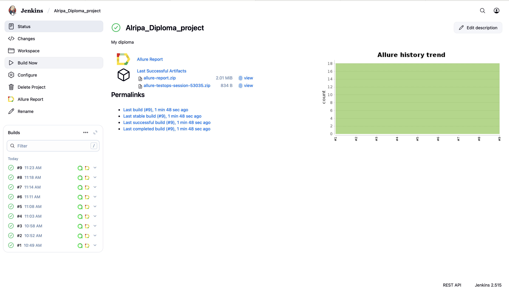
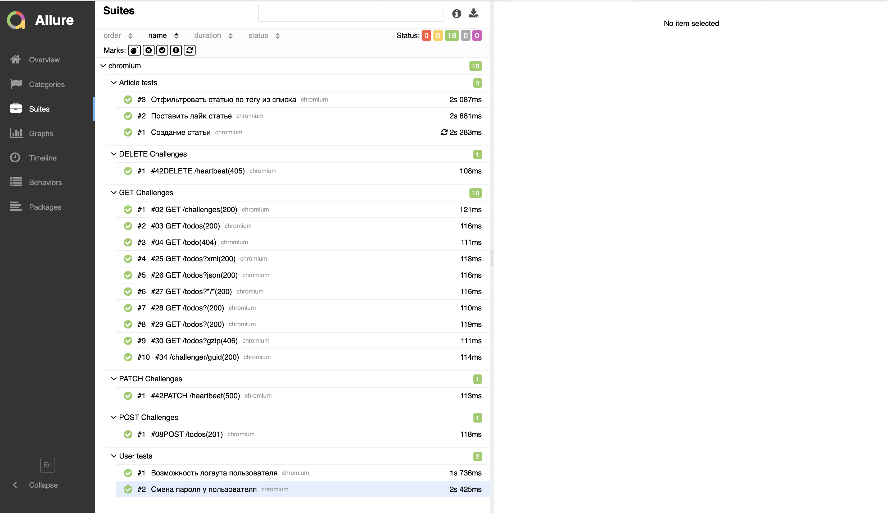
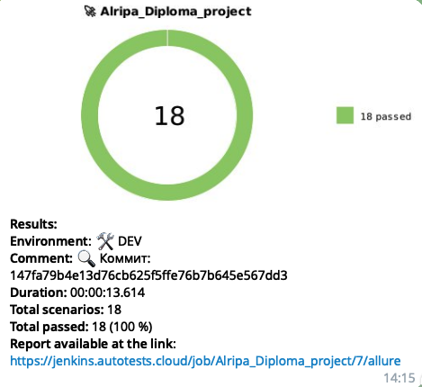

# 🎯Дипломная работа по автоматизации тестирования

## 📑Описание работы
В данном репозитории расположен дипломный проект, который был сделан в качестве выпускной работы в рамках курса автоматизации тестирования. Работа демонстрирует полученные навыки разработки и внедрения автотестов для веб приложений и RESTful API.

В качество объектов тестирования используются:

* **realworld.qa.guru** - сайт, предоставляющий функционал для практики написания автотестов направленных на проверку UI
* **apichallenges.herokuapp.com** - RESTful API позволяющий отработать навыки написания автотестов в части взаимодействия с серверной частью

Проект включает в себя следующие особенности:

* Поддержка нескольких браузеров, в том числе параллельный запуск
* CI/CD интеграция
* Генерация Allure-отчетов
* Уведомления с отчетами о выполнении тестов через бота в Telegram

## 🛠 Технологический стек
- **JavaScript** — язык программирования для написания автоматизированных тестов
- **Playwright** — фреймворк для кросс-браузерного тестирования веб-приложений
- **GitHub** — платформа для хранения кода и совместной разработки
- **GitHub Actions** — инструмент CI/CD для автоматизации процессов через GitHub, в том числе для быстрых прогонов при PR
- **Jenkins** — система непрерывной интеграции и доставки
- **Allure Report** — система визуализации результатов тестирования
- **Telegram** — мессенджер, позволяющий автоинформировать заинтересованных лиц о результатах запусков тестов


## 🚀Установка
Клонировать репозиторий на локальную машину
```
git clone https://github.com/durace1/DIploma_Project.git
```
Установка **node.js.**:
```
npm install
```
Установка **playwright**:
```
npm init playwright@latest
```
Запуск тестов
```
npm t
```
Генерация отчета **allure**:
```
npm run allure
```
## Сборка в Jenkins
Предварительно необходимо зарегистрироваться в [Jenkins](https://jenkins.autotests.cloud/). Нужно открыть [джобу](https://jenkins.autotests.cloud/job/Alripa_Diploma_project/) и нажать на кнопку Build now.


После выполнения джобы можно перейти в [Allure TestOps](https://allure.autotests.cloud/project/4836/dashboards) для просмотра истории прогонов или посмотреть [отчет allure](https://jenkins.autotests.cloud/job/Alripa_Diploma_project/allure/)
## Allure testops


## Allure report


## ✈️Уведомления в telegram
После завершения сборки бот в Telegram автоматически отправляет сообщение с отчетом о результате прогона

